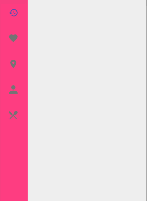
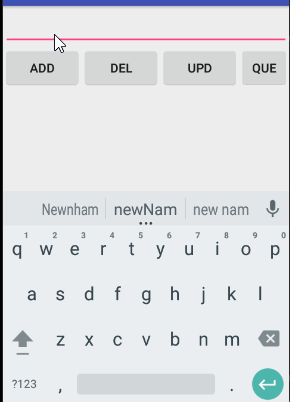

# Android-Notes2

## BottomBarTest
### This package shows  how to use BottomBar.

----

### If you want to see clearly you can click the text below.
[CSDN Blog: How to use BottomBar][1]

## greenDAOTest
### This package shows how to use greenDAO.

-----

[enter description here][2]

  [1]: http://blog.csdn.net/fessible_max/article/details/72802977
  [2]: http://blog.csdn.net/fessible_max/article/details/72854089
